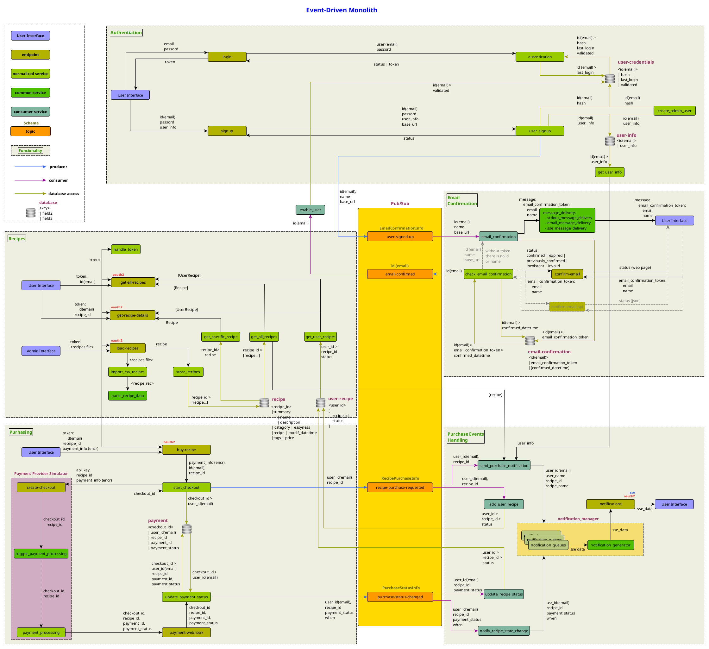

# Event-Driven Monolith PoC

This project is a proof of concept (PoC) to study the viability, strengths, weaknesses and challenges of using an event-driven, services oriented architecture based on publish-subscribe pattern, but using a `monolith` instead of `microservices`.

## Motivation

Typically large projects, specially the ones that deal with huge amount of data, require a lot of scalability and data throughput and so use an event-driven architecture with `microservices` to tackle the related challenges.

This kind of architecture offers:

- **flexibility**, in permitting granular and (almost) independent microservices deployment and use of different languages and technologies
- **decoupling**, because of isolation between microservices and because of the event-driven architecture
- **scalability**, by appending additional microservices to implement new functionality, besides the support to system scalability offered by event-driven architectures

On the other hand `microservices` can bring some drawbacks too:

- complexity of scaling because of the many interaction between microservices
- complications for code reuse and favoring of code duplication between the microservices
- worse performance resulting from many network connections between microservices
- need of coordination of microservices versions

The most part of systems and platforms don't need that huge scalability to meet operation needs and they can benefit of using a simpler `monolithic` architecture with the advantages of:

- **easiness of deploy**, in terms of not needing to match versions and interfaces between microservices.
- **performance**, by not having so much network traffic between services
- simpler **code reuse**
- **avoiding** the increasing **complexity** of coordinating and understanding the interactions between microservices.

But even with these benefits there are many problems that using a `monolith` often brings, especially as the project progresses and many different developers work on it.

- high coupling, that makes the system more unstable and adverse to changes
- lack of flexibility for implementation of new features
- limited system scalability

These are some of the main reasons why people choose event-driven architectures.

So thinking in trying to join the best of both worlds, I've created this project from scratch to study the viability of use `services` integrated in a `monolith` but almost as isolated as `microservices` on an event driven architecture using a pub-sub pattern.

## Project diagram

Below is a system diagram of the PoC:


(click to enlarge)

On the upper left side there is a legend showing the diagram's main components types.

## Project description

The project created for this PoC is a platform where the users can buy cooking `recipes`.

There is a `sign up` functionality with `email confirmation`.

The `login` process returns a `JWT` token to be used to access the rest of the system through `OAuth2`.

On the platform the users can see a summary of each available recipe, with a description, difficulty and it's price and can buy the `recipes` they are interested in.

They can see the `recipes` they already bought and their details.

There is also a `purchase` functionality, with a payment provider simulator to emulate a (simplified) payment process.

The `endpoints` use `services` that are part of the same monolith, but behave somewhat as isolated microservices.

The `services` are responsible for business logic and has access to small `databases` (tables) that provides persistence to them and are isolated too from the rest of the system (in the sense of serving only that functionality).

Decoupling between services of different functionalities comes from a message broker with `RabbitMQ` using a `publish-subscribe` (fan-out) configuration pattern through message passing.

Endpoints use `FastAPI`, `CouchDB` is used as a database and `pytest` as unit tests library.

Further details will be available in a future article that will be referenced here, documenting the project and analyzing the results of the proof of concept (PoC).

## Work in progress

This is a **work in progress**.

Only part of the code was implemented, but what's implemented is functional.

There are unit tests for all code that is implemented (of course 🙂).

Below there are the main parts of the project with indication of what has been implemented or not:

    [x] Sign in
    [x] Login
    [x] Email confirmation
    [x] Recipes importing
    [x] Basic platform operation
    [ ] Basic purchase mechanism
    [ ] Payment provider simulator
    [ ] User purchase notifications
    [ ] Documentation/PoC analysis

## Installing the project

### Installing docker

To build the containers you'll need `docker` (and `docker-compose`) installed on your machine and the corresponding daemon (or service) running in background.

You can find details on installing it here:

- Linux:

    https://docs.docker.com/engine/install/#server
    (prefer to install your distribution's package)

- Mac:

    https://docs.docker.com/desktop/install/mac-install/


### Make utilities

To ease containers building, starting, stopping and general operation there is a `Makefile` with many commands to help you in these tasks.

On the project root directory run:

```shell
make
```
to obtain a list of commands available.

### Environment variables

Critical configuration parameters, like `CouchDB`'s users and passwords and `JWT` token secret key are configured through environment variables.

You can copy `.env_template` file to `.env` on root directory of the project and fill it with the values you desire for the variables.

This file will create the corresponding environment variables inside the containers.

Don't forget to configure them **before** building the containers.

### Building the containers

Make sure your docker daemon/service is started.

To build the container you can use the following command:

```shell
make build
```

This will build containers for `CouchDB`, `RabbitMQ` and the application with `FastAPI` and configure them.

If for some reason you need to restart completely the containers, removing the old ones (and loosing all the data in the databases) to rebuild them, you can use the following command:

```shell
make reset-build
```

(use with care, there is **no** confirmation)

## Project execution

### Starting the containers

Before using the project you need to start the containers, and there is a `make` command for this:

```shell
make start
```
You need to wait to `CouchDB` and `RabbitMQ` containers be available (**Healthy**), because they ar used by the `application container`, and this last container to be **Started** to use the application.

### Endpoints

Thanks to `FastAPI` there is an excellent interactive API documentation on:

http://127.0.0.1/docs

### Unit tests

You can run unit tests using `make` commands.

To run all the tests available use:

```shell
make test
```

To run an specific test you can use `make test`'s parameters to choose the detail level of the test:

```shell
make test file=test_database.py class=TestDatabase test_name=test_get_document_by_fields__general_case
```

As you omit parameters from the left side of the command you executes progressively broader tests.

For example the command below run all `databases` module's tests:

```shell
make test file=test_database.py
```
## Project decisions

The idea of this project is to be a proof of concept (PoC), and so it is a somewhat contrived project.

To maintain things simpler many decisions have been taken that usually would be a bad idea on real productions applications.

They are listed below, but they can be revised at any time in the future.

There are also intentional decisions that make the core of the PoC and are things to be tested by it.

### PoC limitations

- Use of HTTP instead of HTTPS/TLS on `CouchDB`
- `CouchDB` running on a single machine instead of a cluster
- Use of HTTP instead of HTTPS/TLS on `RabbitMQ`
- No authentication on `RabbitMQ`
- `RabbitMQ` running on a single machine instead of a cluster
- No connection failures recovering for `RabbitMQ` (as it's working on a single machine instead of a cluster)
- Use of `BlockingConnection` on `RabbitMQ`

### Intentional decisions

- The `services` are **not** real `microservices`, they are implemented inside the monolith:
  - this is one of the main propositions of this PoC
  - the `services` are designed to be used (by contract) as if they were isolated as real `microservices`
  - the `service` must have a single responsibility (what's a good practice in general)
  - the `service` must, preferably, attend a unique functionality (e.g. `login`, `email confirmation`, etc)
- For storage it was used `CouchDB` databases (that are like tables in relational databases):
  - they must be as simple as possible and store the minimal data used and that make sense to the functionality that the `service` attends
  - the risks of small amount of duplication and eventually inconsistency are tolerated

## Results of the PoC

Results of the PoC will be available on a future document to be referenced here (this is a work in progress at the moment).

## License

> [!CAUTION]
> As this is a Proof of Concept, this code is not proper to be used on production environment without further hardening.

-----------------------------
MIT License

Copyright (c) 2023-to present Armando Máximo Baratti

Permission is hereby granted, free of charge, to any person obtaining a copy
of this software and associated documentation files (the "Software"), to deal
in the Software without restriction, including without limitation the rights
to use, copy, modify, merge, publish, distribute, sublicense, and/or sell
copies of the Software, and to permit persons to whom the Software is
furnished to do so, subject to the following conditions:

The above copyright notice and this permission notice shall be included in all
copies or substantial portions of the Software.

THE SOFTWARE IS PROVIDED "AS IS", WITHOUT WARRANTY OF ANY KIND, EXPRESS OR
IMPLIED, INCLUDING BUT NOT LIMITED TO THE WARRANTIES OF MERCHANTABILITY,
FITNESS FOR A PARTICULAR PURPOSE AND NONINFRINGEMENT. IN NO EVENT SHALL THE
AUTHORS OR COPYRIGHT HOLDERS BE LIABLE FOR ANY CLAIM, DAMAGES OR OTHER
LIABILITY, WHETHER IN AN ACTION OF CONTRACT, TORT OR OTHERWISE, ARISING FROM,
OUT OF OR IN CONNECTION WITH THE SOFTWARE OR THE USE OR OTHER DEALINGS IN THE
SOFTWARE.

-----------------------------

The recipes come from:

- https://publicdomainrecipes.com/
- https://publicdomainrecipes.org/

and are said as being of public domain.
